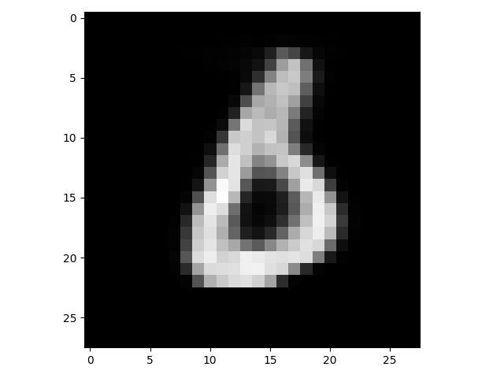

# VRNN pytorch version >= 0.4

### Introduction

The pytorch version (>=0.4) of variable recurrent neural network (VRNN), which is from the paper 'A Recurrent Latent Variable Model for Sequential Data', Junyoung Chung, Kyle Kastner, Laurent Dinh, Kratarth Goel, Aaron Courville, Yoshua Bengio

The origin code is available at [Link]( https://github.com/jych/nips2015_vrnn ) .

### Usage

* Install pytorch (version >= 0.4). My code is implemented under version = 1.1.0

* Run [train.py]( https://github.com/p0werHu/VRNN/blob/master/src/train.py ) at any IDE (Conda virtual environment and Pycharm is recommend)

* Change configurations at [config.py]( https://github.com/p0werHu/VRNN/blob/master/src/config.py ) as you like.

### Results

​	Generation results on MNIST dataset after 60 epochs:

  	
  	
  	
  	
  	

